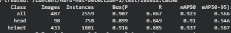

# Helmet Detection for Construction Safety Monitoring 🪖

This project was developed as part of a Deep Learning group project. Construction sites often face challenges in continuously monitoring helmet compliance, as manual supervision can be inconsistent and difficult to scale. To address this problem, we developed a YOLO-based object detection system capable of automatically detecting whether workers are wearing safety helmets, helping support safer construction environments.

## ✨ Project Overview

**Goal:** Detect and classify workers into two safety-related categories:

* Helmet (worker wearing a safety helmet)
* Head (worker without a safety helmet)

**Dataset:** Real-world construction site images

**Models Evaluated:**

* YOLOv11n (baseline, including person class)
* YOLOv11n (refined, person class removed)
* YOLOv8m (refined)
* YOLOv12n (refined)

**Research Focus:** Investigate how dataset refinement and class balancing affect object detection performance in safety monitoring applications.

---

## 📊 Results

* Severe class imbalance was identified in the original dataset, where the person class contained significantly fewer instances than the helmet class.
* Removing the person class improved model performance substantially:

  * Recall: **58.1% → 86.7%**
  * mAP@50: **62.9% → 92.3%**
* The final YOLOv11n model achieved:

  * Precision: **90.7%**
  * Recall: **86.7%**
  * mAP@50: **92.3%**
  * mAP@50-95: **56.6%**
* Dataset refinement contributed more to performance improvement than switching to newer YOLO architectures.

---

## 💡 What I Learned

This project demonstrated that data quality, class balance, and problem understanding can have a greater impact on model performance than simply using a more advanced architecture. Careful dataset refinement proved to be the most important factor in improving detection performance.

---

## 🛠️ Tech Stack

* Python
* PyTorch
* Ultralytics YOLO
* Roboflow
* Google Colab (GPU)

---

## 🚀 Future Improvements

* Improve detection of small, partially occluded, and overlapping objects commonly found in construction environments
* Deploy the model on live CCTV streams for real-time monitoring
* Evaluate performance on edge devices for practical deployment
* Expand the dataset to improve robustness across different construction scenarios

---

## 👥 Team Members

* Luna Alexa
* Nysa Setiawan
* Indira Rubita Bianca
* Nazhifa Kirana Mulya Nugraha
* Franciska Olivia Putri Warae
* Angelyn Nathasya Br. Marpaung

Data Science Students — BINUS University
